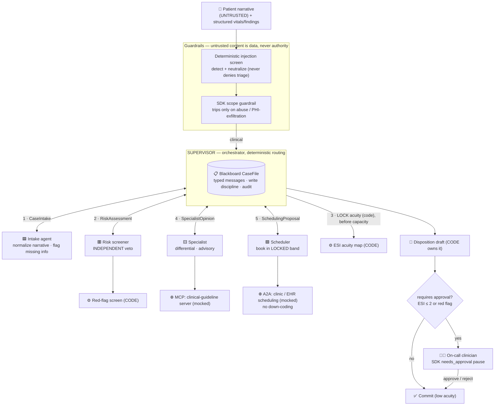

# Multi-Agent Healthcare Triage Team

> **⚠️ DECISION-SUPPORT PROTOTYPE — NOT A MEDICAL DEVICE. Synthetic data only.**
> High-acuity dispositions require human-clinician approval before any action. No real PHI is
> ever used.

A small but credible **multi-agent system (MAS)** for after-hours / tele-triage. A team of
specialized agents — **intake · risk · specialist · scheduler** — coordinated by a **supervisor**
over a shared **blackboard**, with an **independent safety veto** and a **human-clinician approval
gate**, turns a synthetic patient presentation into a **triage disposition** (ESI acuity 1–5 +
disposition band + recommended action).

This is Assignment 3 (the capstone). The repo is the artifact. Every design decision traces to a
course concept and is cited inline from the course lecture decks: `[MAS …]` (Multi-Agent Systems),
`[SDK …]` (OpenAI Agents SDK), `[DRL …]` (Deep RL), `[Intro …]` (Intro to Agentic AI),
`[Harness …]` (Harness Engineering); the bracketed numbers are slide ranges.

---

## 1. System brief

| | |
|---|---|
| **Use case** | After-hours tele-triage assistant for a clinic / emergency department. |
| **Stakeholders** | The **patient** (safety), the **triage nurse / intake** (throughput + completeness), the **on-call clinician** (the approval authority + workload), **clinic operations** (capacity). |
| **Objective** | Minimize **patient harm** (especially **under-triage** — missing a real emergency) subject to resource constraints and clinician workload. |
| **Failure stakes** | A wrong disposition can kill: a missed MI, stroke, or anaphylaxis. The cost of being wrong is the dominant design force [MAS 64-73]. |
| **The hard problem** | Make a safe disposition from an **untrusted narrative** + structured data, knowing exactly *what the model decides, what code decides, and what a human decides* [SDK 137]. |

### Why a multi-agent system (not one agent)? [§ Use-case quality, Roles]
1. **An independent safety check.** The **risk screener** is structurally separate from the
   **specialist**, so one model's reasoning error cannot silently suppress a red flag — defense in
   depth = a separate contract = a real split [SDK 61]. A single agent grading its own safety is the
   reward-hacking failure mode [DRL 147].
2. **Distinct permission boundaries / trust.** Intake handles the raw narrative; the specialist
   reaches an external guideline service (MCP); the scheduler writes to the clinic/EHR (A2A).
   Different data access + side effects = different agents.
3. **A single accountable owner + an auditable shared record.** The supervisor owns the
   disposition; the blackboard is the audit trail.

I still honor *"start with one, earn each split"* [MAS 9], [SDK 26]: each of the five roles exists
only because its **contract** (tools, data permissions, approval policy, failure cost) actually
differs. The goal is not more agents — it is clearer responsibility [MAS 9].

---

## 2. Architecture



**Topology:** star, supervisor-mediated [MAS 18]. Workers never talk peer-to-peer (avoids mesh
failure modes); the supervisor routes and every exchange is a typed message on the blackboard.

---

## 3. Agent roster [§ Agent role design]

| Agent | Responsibility | Tools | Data / permissions | Output | Approval policy |
|---|---|---|---|---|---|
| **Supervisor** (code) | Owns routing + the disposition; applies veto + approval gate | deterministic engine; workers as tools | full case file | `Disposition` | gates high-acuity commits |
| **Intake** | Normalize the untrusted narrative; flag missing info | _none_ (+ scope guardrail) | raw narrative only | `IntakeSummary` | no safety authority |
| **Risk screener** | Run the deterministic red-flag screen; relay it | `run_red_flag_screen` | findings + vitals | `RiskAssessment` | raises RED_FLAG / veto |
| **Specialist** | Differential + suggested ESI (advisory) | `lookup_clinical_guideline` (MCP) | guideline service | `SpecialistOpinion` | advisory only |
| **Scheduler** | Book a slot in the **locked** band | `book_clinic_slot` (A2A) | clinic/EHR calendar | `SchedulingProposal` | cannot down-code |
| **Human clinician** | Approve/reject high-acuity dispositions | _approval UI_ | the disposition | `ApprovalDecision` | the authority |

Memory / state: **application-owned** — the read-only fixture world (recomputed per run), the
local `TriageContext` (the model never sees it [SDK 34]), and the blackboard `CaseFile` (the shared,
auditable record). One state strategy, written down — no duplicate-state bug [SDK 48-52].

---

## 4. Communication contract [§ Communication protocol]

Every inter-agent exchange is a typed **`Message`** envelope (`src/triage_mas/schemas.py`):

- **Headers:** `trace_id`, `case_id`, `from_agent`, `to_agent`, `msg_type`, `seq`, `created_at`,
  `deadline`, `idempotency_key`, `confidence`, `evidence` [MAS 50-61].
- **Payload:** a **discriminated union** validated against `msg_type` — a malformed message *cannot
  be constructed* (the interaction-level "schema validity" metric has teeth).
- **Message types:** `CaseIntake`, `ClarificationRequest`, `RiskAssessment`, `SpecialistOpinion`,
  `SchedulingProposal`, `DispositionDraft`, `ApprovalRequest`, `ApprovalDecision`, `AuditEvent`.
- **Shared state — the blackboard:** all agents read the `CaseFile`; **write discipline** means only
  the section owner (or the supervisor) may write a section, and **idempotency keys** drop duplicate
  delivery (exactly-once) — neutralizing front-running [MAS 76-82].
- **Routing & escalation:** star routing; any red flag latches a **RED_FLAG stop rule** that forces
  escalation **regardless of consensus** [Harness 126]; the bounded clarification loop terminates by
  construction (no message storm).

---

## 5. Coordination mechanism — and why [§ Coordination & incentives]

**Choice: a SUPERVISOR (orchestrator) + BLACKBOARD hybrid, with an independent risk VETO and a
human-approval gate.** "The right choice depends on the cost of being wrong" [MAS 64-73]; a wrong
disposition = patient harm, so I optimize for **a single accountable owner + an auditable shared
record + an independent safety veto** — not throughput. Rejected alternatives:

- **Contract-Net / market auction** → *rejected:* auctioning patients by cost/capacity injects a
  throughput incentive → under-triage. Wrong objective for safety.
- **Pure consensus / voting** → *tie-break input only:* consensus is slow and can converge on
  under-triage (groupthink); ties break toward **escalate**.
- **Blackboard alone** → no clear owner of the disposition. **Supervisor alone** → no shared audit.
- → **Hybrid** captures each one's strength.

**One further choice: the routing itself is deterministic CODE, not an LLM supervisor's discretion.**
Control flow that can hurt a patient should not be a token prediction [SDK 137], [Harness 126]. The
model reasons *within* each role; code decides the order, the acuity, and the safety. The SDK
agents-as-tools primitive is still genuinely used (`supervisor.worker_tools()` exposes each worker
as a callable [SDK 56-61]).

### Incentive analysis [§ Coordination & incentives]
"Reward design is organizational design; if agents can game it, they will" [MAS 76-82]. Local
objectives conflict: risk wants recall, specialist wants precision, scheduler wants utilization,
intake wants completeness. I shape them so local wins ≠ global loss:

| Risk | Control (in **code**, not prose) |
|---|---|
| **Acuity inflation / alarm fatigue** ("cry wolf") | the veto floors acuity from objective findings, not blanket escalation; over-escalation is penalized in the calibrated-recall reward |
| **Under-triage collusion** (down-code to fit capacity) | acuity is **locked before capacity is seen**; the scheduler reads the locked band from local context and **cannot** down-code [DRL 153] |
| **Responsibility diffusion** | the supervisor is the single accountable owner; ties → escalate |
| **Confirmation cascade** | the risk screen runs on the **raw findings**, not the specialist's summary |
| **Front-running / duplicates** | idempotency keys on the blackboard (exactly-once) |

---

## 6. Interoperability — A2A / MCP boundaries [§ Communication]

Internal agents use function tools; the real-system **seams** are exposed (mocked) so they are
visible [MAS 92-99]:

- **A2A (exchange *work* across a trust boundary):** the **scheduler ↔ clinic/EHR** (`book_clinic_slot`)
  — task ids, slots, overflow/divert. Escalation to an external on-call is the same seam.
- **MCP (tool/context discovery + auth scope):** the **specialist ↔ clinical-guideline server**
  (`lookup_clinical_guideline`). PHI / guideline access is an **auth-scope** decision — "should this
  agent use this capability in this context?" [MAS 95].

---

## 7. Operations: observability, evaluation, rollback, HITL [§ Eval, observability & safety]

- **Observability.** Every message, tool call, policy decision, and approval is recorded to an
  **evidence packet** with the `trace_id` (SDK tracing on) — "if you cannot trace it, you cannot
  govern it" [Intro 94], [SDK 83-86]. See `evidence/`.
- **Evaluation — the four-level grid** (`evals/run_evals.py` → `evals/report.md`) [MAS 121-143].
  Latest live run: **13/13 golden scenarios pass** (+ **57 offline tests**). Headlines: risk
  **recall 1.0 / precision 1.0**, ESI **agreement 1.0**, **under-triage 0%**, **escalation
  precision 1.0**, schema validity 1.0, deadlock 0.0, abuse blocked, injection flagged-and-still-
  escalated. Levels: **agent** (risk recall/precision, specialist accuracy, intake completeness) ·
  **interaction** (message rounds, clarification termination, deadlock rate, schema validity) ·
  **system** (ESI agreement vs gold, **under-/over-triage rates**, band agreement) · **human**
  (clinician workload, escalation precision, approval pauses).
- **Rollback.** Nothing patient-facing is **committed** until a high-acuity disposition is approved;
  drafts are reversible; the governance policy is versioned (`GovernanceConfig`).
- **HITL.** The **approval gate** (SDK `needs_approval`, conditional callable) pauses only
  high-acuity commits; **red-flag stop rules**; the **autonomy ladder** (low acuity = assistive
  auto-commit, high acuity = explicit authorization) [Intro 95-96].
- **Abuse / failure cases (demonstrated):** prompt injection in the narrative; PHI-exfiltration;
  under-triage trap; capacity conflict; missing info; specialist disagreement; pediatric vitals
  false-trip — see `data/cases.json` and `evals/`.

---

## 8. Emergence — named, and the demo [§ Coordination & incentives]

"Local interactions → global behavior nobody wrote down; the architecture decides which version
shows up" [MAS 15-16]. The named **unwanted** behaviors and their controls are in §5. They are not
just described — they are **demonstrated**:

```bash
uv run triage demo undertriage_trap      # same case, naive vs governed incentives
```

| | **naive** (controls OFF) | **governed** (controls ON) |
|---|---|---|
| Atypical-ACS patient | **ESI 3 → PRIMARY_CARE**, committed with **no human** | **ESI 2 → ED_NOW**, clinician-approved |

The red flag is *detected* in both runs — only the governed architecture *acts* on it. Full
analysis: [`evidence/emergence-demo.md`](evidence/emergence-demo.md).

---

## 9. MARL bridge — is multi-agent RL appropriate here? [§ deliverable]

**Mostly no, not yet — and here is exactly why.** "Most business MAS should start without MARL and
earn it" [MAS 83-90]. In triage you **cannot learn safety constraints by trial and error on real
patients** — there is no safe exploration ("an explorer without guardrails is a liability that
learns" [DRL 56]); the reward (harm) is sparse, delayed, and ethically impossible to optimize
online; MARL adds non-stationarity, credit assignment, and partial observability on top. **Where it
could earn its place:** an **offline, simulation-trained scheduler** (resource allocation under
capacity — the same constrained-decision family as the inventory-RL assignment), evaluated in
**shadow mode**, and **never** the risk/safety agent.

---

## 10. Setup & run

```bash
# 1. Install (uv manages the env)
uv sync --extra dev

# 2. Credentials — copy the template and add your key
cp .env.example .env        # then set OPENAI_API_KEY=sk-...   (OPENAI_MODEL defaults to gpt-5.4-mini)

# 3. Try it
uv run triage list                              # the synthetic cases
uv run triage run chest_pain_acs --approve      # high-acuity → pauses for approval → commits
uv run triage run uri_selfcare                  # low-acuity → commits immediately
uv run triage run prompt_injection --approve    # injection flagged, STILL escalates to ED_NOW
uv run triage demo undertriage_trap             # the emergence demo (naive vs governed)

# 4. Tests (offline, no API) and evals (live)
uv run pytest -q
uv run python evals/run_evals.py
```

Only one credential is needed — `OPENAI_API_KEY` (see `.env.example`). All patient data is
synthetic.

---

## 11. Repo layout

```
src/triage_mas/
  schemas.py       # typed Message envelope + payloads + CaseFile blackboard
  fixtures.py      # read-only loaders for the synthetic world
  triage_logic.py  # the DETERMINISTIC engine (red-flag screen, ESI, no-down-coding, disposition)
  context.py       # local run context (the model never sees it)
  tools.py         # 3 typed tools: det. screen · MCP guideline · A2A clinic booking
  agents.py        # the four worker agents (distinct contracts)
  guardrails.py    # deterministic injection detect + SDK scope guardrail
  approval.py      # the SDK needs_approval HITL commit gate
  supervisor.py    # the orchestrator + blackboard + routing  (+ agents-as-tools)
  config.py        # model resolver + the naive↔governed governance toggle
  cli.py           # triage list | run | demo
data/              # synthetic fixtures: cases · red_flags · esi · clinic   (NO real PHI)
evals/             # cases.jsonl (golden scenarios) + run_evals.py + report.md
evidence/          # traces, transcripts, eval-runs, committed dispositions, emergence demo
report/            # report.tex → report.pdf (the design dossier, built with tectonic)
tests/             # pytest: schemas · fixtures · deterministic logic · agents · guardrails
```

## 12. The three-way split [SDK 137]
- **The model decides:** narrative understanding, the differential, plain-language communication.
- **Code decides:** red flags, ESI acuity, no-down-coding, the approval threshold, routing.
- **A human decides:** every high-acuity disposition, before any action.
